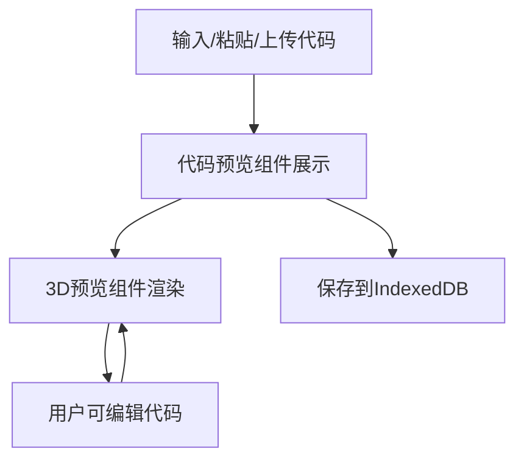

## 1. 产品概述

一个基于Web的3D模型预览工具，支持build123d代码的实时渲染预览。用户可以输入、粘贴或上传build123d代码，在浏览器中实时查看3D模型效果。

**核心价值**：提供即时的3D模型预览能力，配合coding agent使用，提升开发效率。

## 2. 核心功能

### 2.1 用户角色
| 角色 | 注册方式 | 核心权限 |
|------|----------|----------|
| 用户 | 无需注册 | 输入代码、预览3D模型、保存历史记录 |

### 2.2 功能模块
1. **代码输入组件**：支持输入、粘贴、拖放代码
2. **代码预览组件**：展示代码，支持语法高亮和编辑
3. **3D预览组件**：实时渲染3D模型，支持旋转、缩放、平移
4. **历史记录**：使用IndexedDB存储代码历史

### 2.3 页面详情
| 页面名称 | 模块名称 | 功能描述 |
|----------|----------|----------|
| 主页 | 代码输入区 | 输入/粘贴/上传build123d代码 |
| 主页 | 代码预览区 | 展示代码，支持编辑和复制 |
| 主页 | 3D预览区 | 渲染3D模型，支持交互操作 |

## 3. 核心流程

**用户流程**：
1. 用户输入或粘贴build123d代码
2. 代码展示在代码预览组件中
3. 3D预览组件解析代码并渲染模型
4. 用户可以编辑代码，预览实时更新
5. 代码自动保存到IndexedDB

**Mermaid流程图**：

## 4. 用户界面设计

### 4.1 设计风格
- **主色调**：深色主题，科技感
- **字体**：JetBrains Mono（代码）+ Inter（界面）
- **布局**：左侧代码，右侧3D预览

### 4.2 页面设计概述
| 页面名称 | 模块名称 | UI元素 |
|----------|----------|--------|
| 主页 | 代码区 | 代码编辑器、运行按钮、上传按钮 |
| 主页 | 预览区 | 3D画布、视角控制、模型信息 |

### 4.3 响应式设计
- **桌面端**：左右两栏布局
- **移动端**：单栏切换

### 4.4 3D场景指导
- **背景**：深色渐变
- **光照**：环境光+点光源
- **交互**：轨道控制
