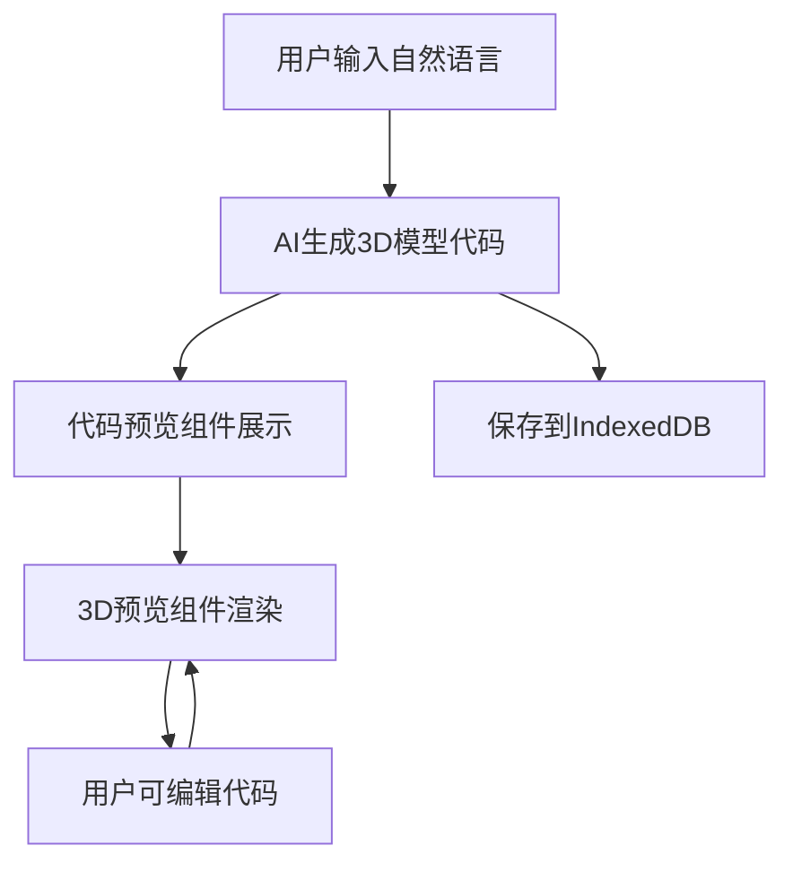

## 1. 产品概述

一个基于Web的AI 3D模型生成工具。用户通过自然语言与AI对话，AI生成build123d风格的3D模型描述代码，在前端实时预览3D模型效果。

**核心价值**：降低3D建模门槛，通过自然语言快速创建3D模型，实时预览效果。

## 2. 核心功能

### 2.1 用户角色
| 角色 | 注册方式 | 核心权限 |
|------|----------|----------|
| 用户 | 无需注册 | 使用AI对话、预览3D模型、保存历史记录 |

### 2.2 功能模块
1. **AI对话组件**：输入自然语言描述，AI返回3D模型代码
2. **代码预览组件**：展示生成的代码，支持编辑和复制
3. **3D预览组件**：实时渲染3D模型，支持旋转、缩放、平移
4. **历史记录**：使用IndexedDB存储对话历史

### 2.3 页面详情
| 页面名称 | 模块名称 | 功能描述 |
|----------|----------|----------|
| 主页 | AI对话组件 | 输入自然语言描述想要创建的3D模型 |
| 主页 | 代码预览组件 | 展示生成的代码，支持编辑 |
| 主页 | 3D预览组件 | 渲染3D模型，支持交互操作 |

## 3. 核心流程

**用户流程**：
1. 用户在对话输入框中输入自然语言描述
2. AI生成对应的3D模型代码（基于build123d语法风格）
3. 代码展示在代码预览组件中
4. 3D预览组件解析代码并渲染模型
5. 用户可以编辑代码，预览实时更新
6. 对话自动保存到IndexedDB

**Mermaid流程图**：

## 4. 用户界面设计

### 4.1 设计风格
- **主色调**：深色主题，科技感
- **字体**：JetBrains Mono（代码）+ Inter（界面）
- **布局**：左侧对话，右侧代码和预览

### 4.2 页面设计概述
| 页面名称 | 模块名称 | UI元素 |
|----------|----------|--------|
| 主页 | 对话区 | 消息列表、输入框、发送按钮 |
| 主页 | 代码区 | 代码编辑器、运行按钮 |
| 主页 | 预览区 | 3D画布、视角控制 |

### 4.3 响应式设计
- **桌面端**：左右两栏布局
- **移动端**：单栏切换

### 4.4 3D场景指导
- **背景**：深色渐变
- **光照**：环境光+点光源
- **交互**：轨道控制
