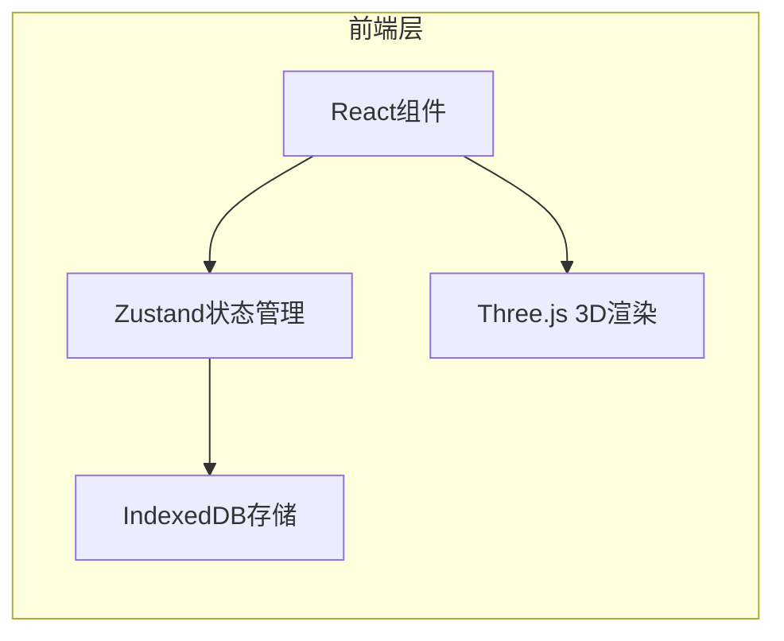

## 1. 架构设计



## 2. 技术描述

- **前端**：React@18 + TypeScript + TailwindCSS@3 + Vite
- **状态管理**：Zustand
- **3D渲染**：Three.js + @react-three/fiber + @react-three/drei
- **存储**：IndexedDB (idb库)
- **代码高亮**：@codemirror/state + @codemirror/view + @codemirror/lang-python

## 3. 路由定义

| 路由 | 用途 |
|------|------|
| / | 主页，代码+预览 |

## 4. 数据模型

### 4.1 IndexedDB数据结构

**数据库名称**：build123d-preview

**存储对象**：
- **codeHistory**：存储代码历史记录

### 4.2 类型定义

```typescript
interface CodeHistory {
  id: string;
  name: string;
  code: string;
  createdAt: string;
  updatedAt: string;
}
```

## 5. 项目结构

```
src/
├── components/
│   ├── CodeEditor.tsx    # 代码编辑器组件
│   ├── ModelPreview.tsx  # 3D模型预览组件
│   └── HistoryPanel.tsx  # 历史记录面板
├── hooks/
│   └── useIndexedDB.ts   # IndexedDB操作hook
├── stores/
│   └── appStore.ts       # Zustand状态管理
├── utils/
│   ├── codeParser.ts     # build123d代码解析器
│   └── db.ts             # IndexedDB初始化
├── types/
│   └── index.ts          # TypeScript类型定义
├── App.tsx               # 主应用组件
├── main.tsx              # 入口文件
└── index.css             # 全局样式
```
